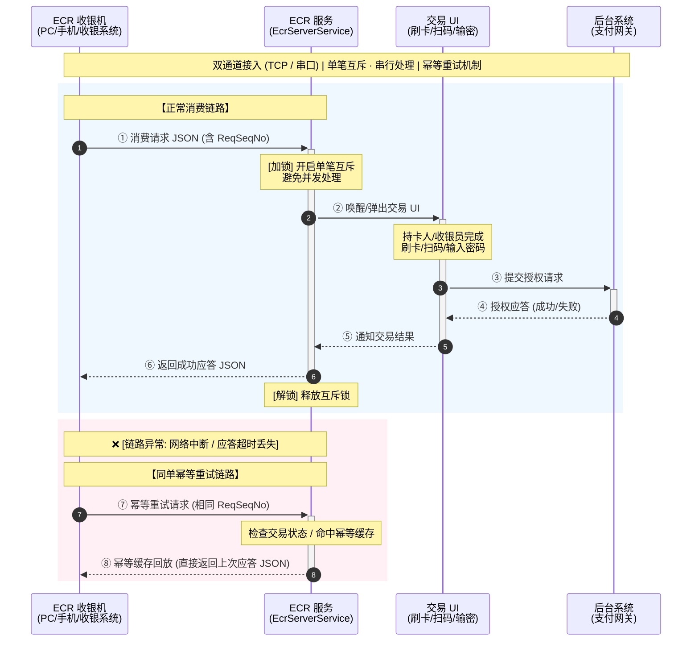

```mermaid
sequenceDiagram
    autonumber
    participant ECR as ECR 收银机<br/>(PC/手机/收银系统)
    participant SVC as ECR 服务<br/>(EcrServerService)
    participant UI as 交易 UI<br/>(刷卡/扫码/输密)
    participant GW as 后台系统<br/>(支付网关)

    %% 标题与属性声明
    Note over ECR,GW: 双通道接入 (TCP / 串口) | 单笔互斥 · 串行处理 | 幂等重试机制

    %% 主交易流程
    rect rgb(240, 248, 255)
        Note over ECR,SVC: 【正常消费链路】
        ECR->>+SVC: ① 消费请求 JSON (含 ReqSeqNo)
        Note over SVC: [加锁] 开启单笔互斥<br/>避免并发处理
        SVC->>+UI: ② 唤醒/弹出交易 UI
        
        Note over UI: 持卡人/收银员完成<br/>刷卡/扫码/输入密码
        
        UI->>+GW: ③ 提交授权请求
        GW-->>-UI: ④ 授权应答 (成功/失败)
        
        UI-->>-SVC: ⑤ 通知交易结果
        SVC-->>-ECR: ⑥ 返回成功应答 JSON
        Note over SVC: [解锁] 释放互斥锁
    end

    %% 异常重试流程
    rect rgb(255, 240, 245)
        Note over ECR,SVC: ❌ [链路异常: 网络中断 / 应答超时丢失]
        
        Note over ECR,SVC: 【同单幂等重试链路】
        ECR->>+SVC: ⑦ 幂等重试请求 (相同 ReqSeqNo)
        Note over SVC: 检查交易状态 / 命中幂等缓存
        SVC-->>-ECR: ⑧ 幂等缓存回放 (直接返回上次应答 JSON)
    end
```
